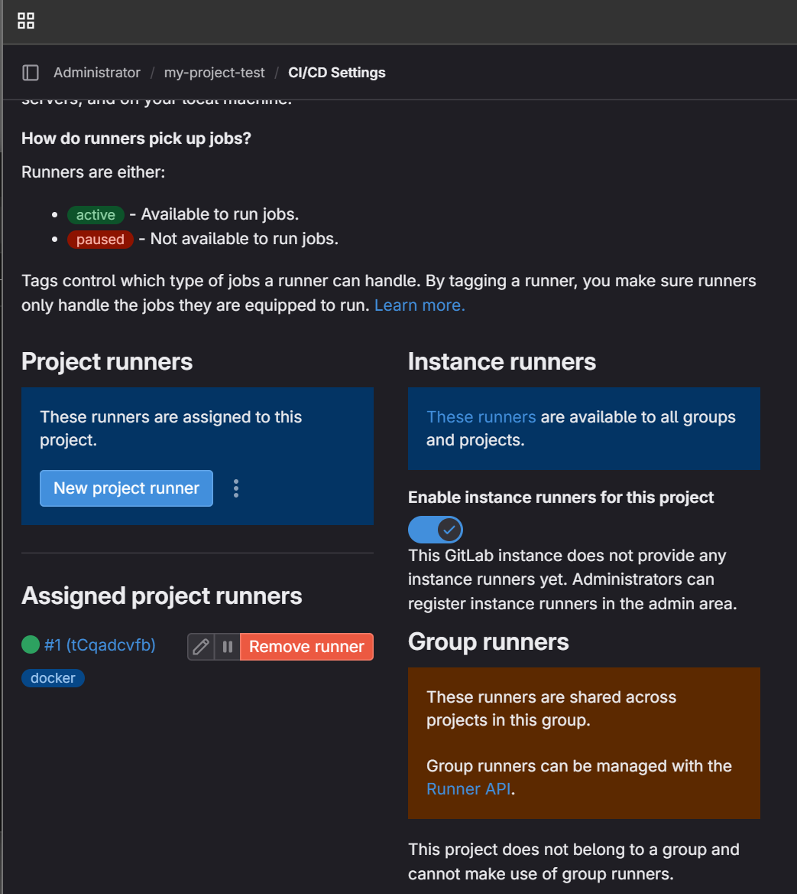
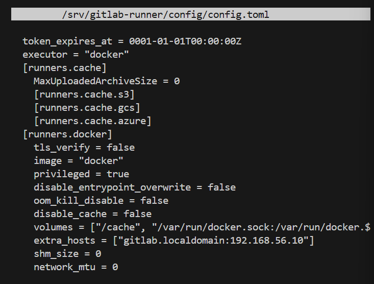
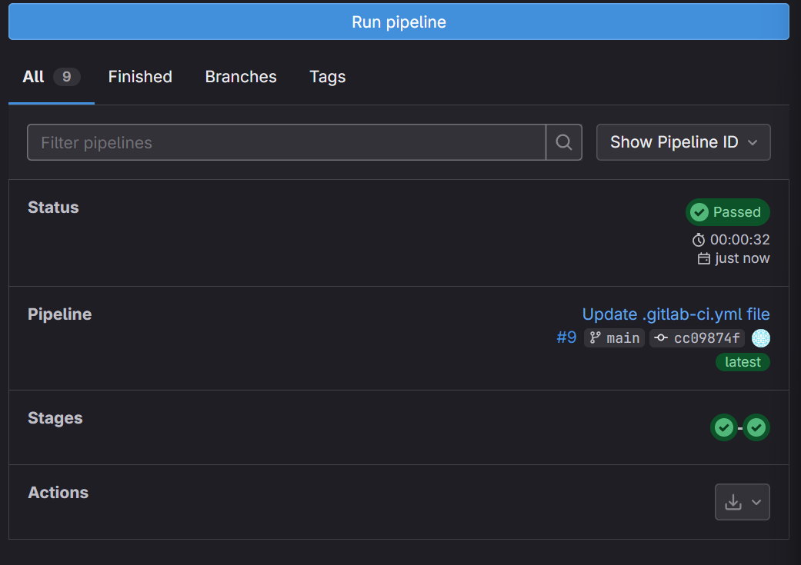

# Домашнее задание по занятию "GitLab" — Моськов Максим

## Задание 1: Развертывание GitLab и регистрация Runner

### Описание решения:
1. **Развертывание**: С помощью Vagrant и VirtualBox была развернута виртуальная машина на базе Debian 12 (использован бокс `debian/bookworm64`).
2. **Установка**: Внутри ВМ был установлен GitLab EE. Доступ к интерфейсу осуществляется по адресу `http://gitlab.localdomain` (IP 192.168.56.10).
3. **Проект**: Создан новый пустой проект `my-project-test`.
4. **Раннер**: Зарегистрирован `gitlab-runner` с использованием Docker-исполнителя (executor). 

### Настройки Runner в проекте:
На скриншоте ниже видно, что раннер успешно зарегистрирован, имеет тег `docker` и активен (зеленый статус).



### Конфигурация Runner (config.toml):
Для обеспечения работы режима Docker-in-Docker в файл конфигурации были внесены следующие правки:
* Установлен параметр `privileged = true`.
* Настроен проброс сокета: `volumes = ["/cache", "/var/run/docker.sock:/var/run/docker.sock"]`.
* Добавлен `extra_hosts` для связи с локальным доменом GitLab.




---

## Задание 2: Настройка CI/CD Pipeline

### Описание решения:
Создан файл `.gitlab-ci.yml` для автоматизации тестирования и сборки.
Для решения проблем с сетевыми ограничениями и версиями API были применены следующие настройки:
* Использование локальных образов через политику `pull_policy: [if-not-present]`.
* Принудительное указание версии API: `DOCKER_API_VERSION: "1.41"`.
* В `config.toml` раннера разрешены локальные политики (`allowed_pull_policies`).



### Итоговый файл .gitlab-ci.yml:
```yaml
stages:
  - test
  - build

variables:
  DOCKER_API_VERSION: "1.41"

test_job:
  stage: test
  image: 
    name: golang:1.17
    pull_policy: [if-not-present]
  script:
    - echo "Running tests..."
    - go version

build_job:
  stage: build
  image: 
    name: docker:latest
    pull_policy: [if-not-present]
  script:
    - echo "Checking Docker..."
    - docker info
    - echo "Building dummy image..."
    - echo "FROM alpine:latest" > Dockerfile
    - docker build -t my-test-image:local .

